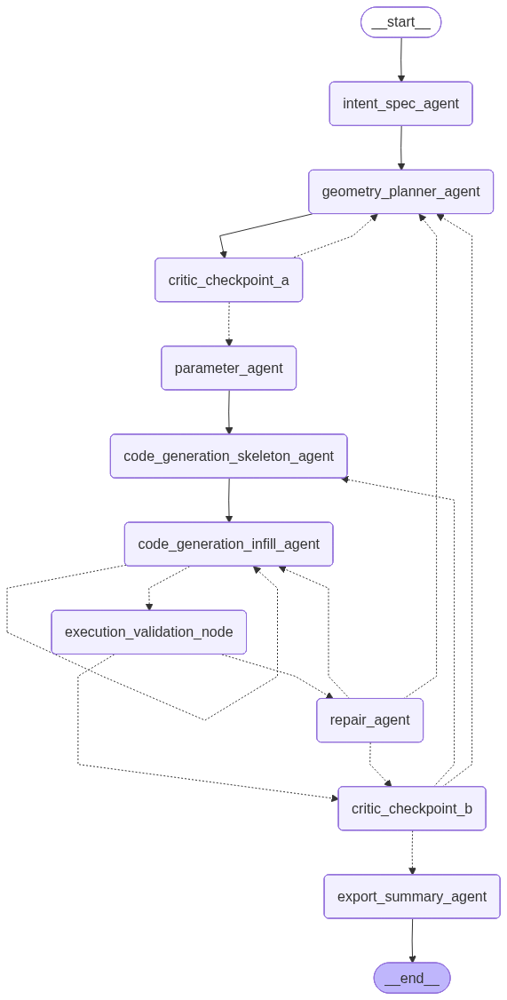

# CadPilot v3

CadPilot v3 is a multi-agent CAD generation pipeline for turning natural-language
part requests into validated CadQuery geometry and exported CAD files. It uses
LangGraph to coordinate planning, critique, parameter selection, code generation,
execution validation, repair, and final reporting.

## Pipeline Graph



The graph is generated from the live LangGraph pipeline definition in
`src/cadpilotv3/graph/pipeline.py`.

## What It Does

- Converts a user prompt into a structured intent specification.
- Builds a geometry plan and critiques it before code generation.
- Selects manufacturing-aware parameters for the requested part.
- Generates CadQuery code, executes it in a sandbox, and validates the result.
- Routes failed executions through a repair loop or replans when needed.
- Runs a final design critique before exporting files and a summary report.

## Pipeline Stages

| Stage | Purpose |
| --- | --- |
| `intent_spec_agent` | Extracts the design intent, constraints, units, and output requirements. |
| `geometry_planner_agent` | Produces the high-level CAD construction plan. |
| `critic_checkpoint_a` | Reviews the plan before parameterization and code generation. |
| `parameter_agent` | Selects dimensions, tolerances, and manufacturing parameters. |
| `code_generation_infill_agent` | Generates executable CadQuery code. |
| `execution_validation_node` | Runs the generated code and checks whether repair is required. |
| `repair_agent` | Patches code issues or routes back to planning for larger failures. |
| `critic_checkpoint_b` | Performs final critique and decides whether to export, patch, or replan. |
| `export_summary_agent` | Produces the final user-facing export summary. |

## Project Layout

```text
.
|-- main.py                         # Example pipeline entry point
|-- artifacts/
|   |-- pipeline_graph.mmd           # Mermaid source for the graph
|   `-- pipeline_graph.png           # Rendered pipeline graph
|-- scripts/
|   `-- render_graph_png.py          # Regenerates the graph image
|-- src/cadpilotv3/
|   |-- agents/                      # Agent wrappers
|   |-- config/                      # Settings and constants
|   |-- graph/                       # LangGraph pipeline, state, and routing
|   |-- prompts/                     # Prompt templates and examples
|   |-- schemas/                     # Pydantic schemas
|   |-- services/                    # LLM, CAD, validation, export services
|   `-- shared/                      # Shared utilities
`-- tests/                           # Test suite
```

## Setup

This project uses Python 3.11+ and `uv` for environment management.

```powershell
uv sync
```

Create a `.env` file with the provider credentials you want to use:

```env
OPENAI_API_KEY=...
LANGSMITH_API_KEY=...
LANGSMITH_TRACING=true
```

The main settings live in `src/cadpilotv3/config/settings.py`. Common knobs
include LLM provider/model selection, repair limits, artifact paths, and CadQuery
execution/export options.

## Run the Example Pipeline

```powershell
uv run python main.py
```

The default prompt in `main.py` asks the system to design a CNC-machined bearing
pillow block for a 608 bearing and export CAD files.


## Outputs

Generated CAD artifacts, graph images, and related pipeline outputs are written
under `artifacts/` unless overridden in the application settings.
