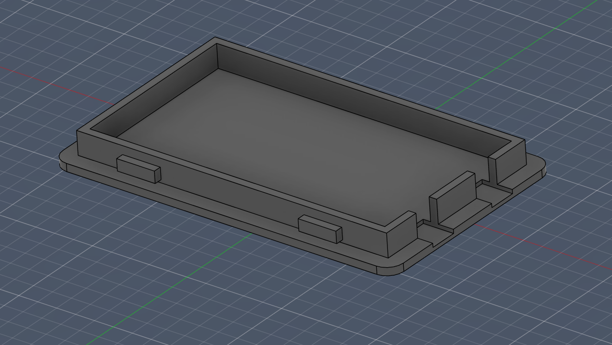
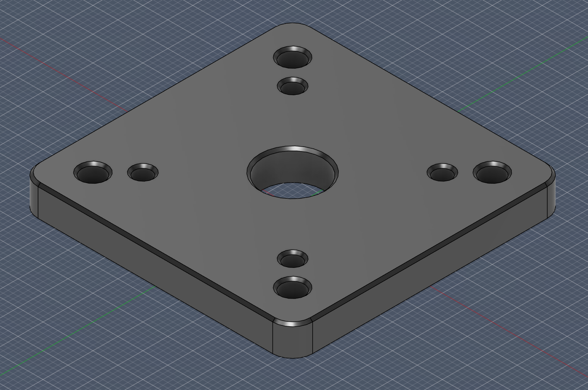
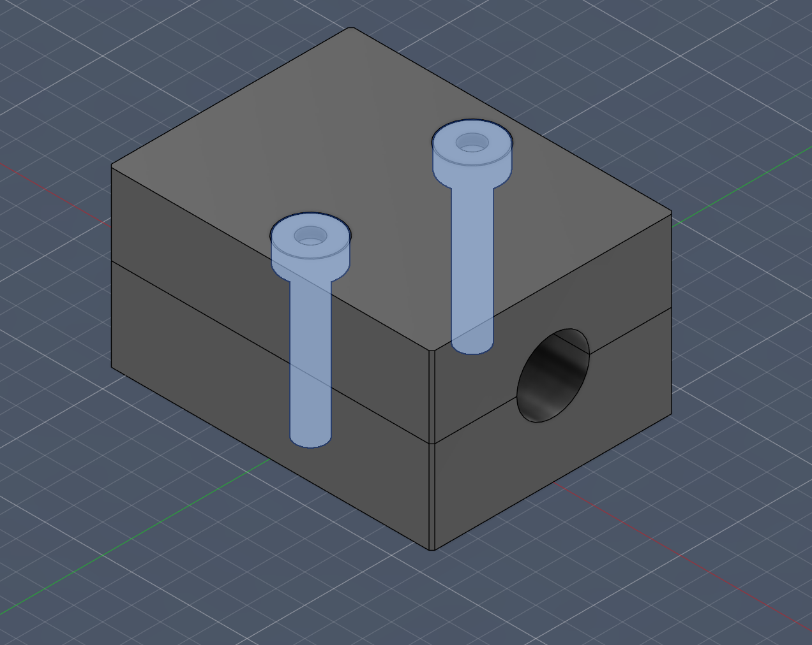

# CadPilot v3

CadPilot v3 is a multi-agent CAD generation pipeline for turning natural-language
part requests into validated CadQuery geometry and exported CAD files. It uses
LangGraph to coordinate planning, critique, parameter selection, code generation,
execution validation, repair, and final reporting.

## Pipeline Graph


The graph is generated from the live LangGraph pipeline definition in
`src/cadpilotv3/graph/pipeline.py`.

## Sample Generated Parts

These images show example CAD outputs generated by the CadPilot v3 pipeline.
The rendered samples live under `artifacts/samples/images/`.

| | | |
| --- | --- | --- |
|  |  |  |
| Bearing pillow block | Snap-on enclosure lid | Bolt-pattern adapter plate |
|  |  |  |
| NEMA 17 motor mount | Split tube clamp block | Two-part enclosure assembly |

## What It Does

- Converts a user prompt into a structured intent specification.
- Builds a geometry plan and critiques it before code generation.
- Selects manufacturing-aware parameters for the requested part.
- Generates CadQuery code, executes it in a sandbox, and validates the result.
- Routes failed executions through a repair loop or replans when needed.
- Runs a final design critique before exporting files and a summary report.

## Pipeline Stages

| Stage | Purpose |
| --- | --- |
| `intent_spec_agent` | Extracts the design intent, constraints, units, and output requirements. |
| `geometry_planner_agent` | Produces the high-level CAD construction plan. |
| `critic_checkpoint_a` | Reviews the plan before parameterization and code generation. |
| `parameter_agent` | Selects dimensions, tolerances, and manufacturing parameters. |
| `code_generation_infill_agent` | Generates executable CadQuery code. |
| `execution_validation_node` | Runs the generated code and checks whether repair is required. |
| `repair_agent` | Patches code issues or routes back to planning for larger failures. |
| `critic_checkpoint_b` | Performs final critique and decides whether to export, patch, or replan. |
| `export_summary_agent` | Produces the final user-facing export summary. |

## Project Layout

```text
.
|-- main.py                         # Example pipeline entry point
|-- artifacts/
|   |-- pipeline_graph.mmd           # Mermaid source for the graph
|   `-- pipeline_graph.png           # Rendered pipeline graph
|-- scripts/
|   `-- render_graph_png.py          # Regenerates the graph image
|-- src/cadpilotv3/
|   |-- agents/                      # Agent wrappers
|   |-- config/                      # Settings and constants
|   |-- graph/                       # LangGraph pipeline, state, and routing
|   |-- prompts/                     # Prompt templates and examples
|   |-- schemas/                     # Pydantic schemas
|   |-- services/                    # LLM, CAD, validation, export services
|   `-- shared/                      # Shared utilities
`-- tests/                           # Test suite
```

## Installation And Setup

### Prerequisites

- Python 3.11 or newer.
- `uv` for dependency and virtual environment management.
- An OpenAI, Anthropic, or OpenRouter API key, depending on the provider you
  want to use.

Install `uv` if it is not already available:

```powershell
pip install uv
```

Confirm the tools are available:

```powershell
python --version
uv --version
```

### Install Dependencies

From the repository root:

```powershell
uv sync
```

This creates the local virtual environment and installs the project dependencies,
including CadQuery, LangChain, LangGraph-compatible packages, and provider SDKs.

If `uv` has trouble creating its user-level cache on Windows, use the repo-local
cache directory:

```powershell
$env:UV_CACHE_DIR = ".uv-cache"
uv sync
```

### Configure Environment Variables

Create a `.env` file in the repository root.

For OpenAI:

```env
LLM_PROVIDER=openai
OPENAI_API_KEY=your_openai_key_here
LLM_MODEL=gpt-4.1
LLM_REASONING_MODEL=gpt-4.1
LLM_CRITIC_MODEL=gpt-4.1
LLM_CODE_MODEL=gpt-5.4
INTENT_WEB_RESEARCH_ENABLED=true
INTENT_WEB_RESEARCH_CONTEXT_SIZE=low
```

When `LLM_PROVIDER=openai`, the intent spec agent can use OpenAI web search to
look up real-world product, connector, PCB, and mounting dimensions before it
builds the structured CAD spec. Set `INTENT_WEB_RESEARCH_ENABLED=false` to
disable that step, or set `INTENT_WEB_RESEARCH_MODEL` to use a different model
for the research pass.

Optional LangSmith tracing:

```env
LANGSMITH_TRACING=true
LANGSMITH_API_KEY=your_langsmith_key_here
LANGSMITH_PROJECT=cadpilotv3
```

For Anthropic:

```env
LLM_PROVIDER=anthropic
ANTHROPIC_API_KEY=your_anthropic_key_here
```

For OpenRouter:

```env
LLM_PROVIDER=openrouter
OPENROUTER_API_KEY=your_openrouter_key_here
OPENROUTER_BASE_URL=https://openrouter.ai/api/v1
```

The main settings live in `src/cadpilotv3/config/settings.py`. Common knobs
include:

- LLM provider and model selection.
- intent web research enablement, model, timeout, and context size.
- repair and critic retry limits.
- artifact output paths.
- CadQuery execution timeout.
- STEP, STL, and DXF export toggles.
- prompt directory location.

### Verify The Install

Run the test suite:

```powershell
uv run pytest
```

Run Ruff:

```powershell
uv run ruff check src tests
```

If pytest hits temporary directory permission issues on Windows, set a local
cache first:

```powershell
$env:UV_CACHE_DIR = ".uv-cache"
uv run pytest
```

### Run The Example Pipeline

```powershell
uv run python main.py
```

The default prompt in `main.py` asks the system to generate the configured CAD
example prompt and export CAD files.

Generated outputs are written under:

```text
artifacts/
.sandbox_runs/
output/
```

LLM traces, when enabled, are written under:

```text
artifacts/llm_runs/
```

## Outputs

Generated CAD artifacts, graph images, and related pipeline outputs are written
under `artifacts/` unless overridden in the application settings.
