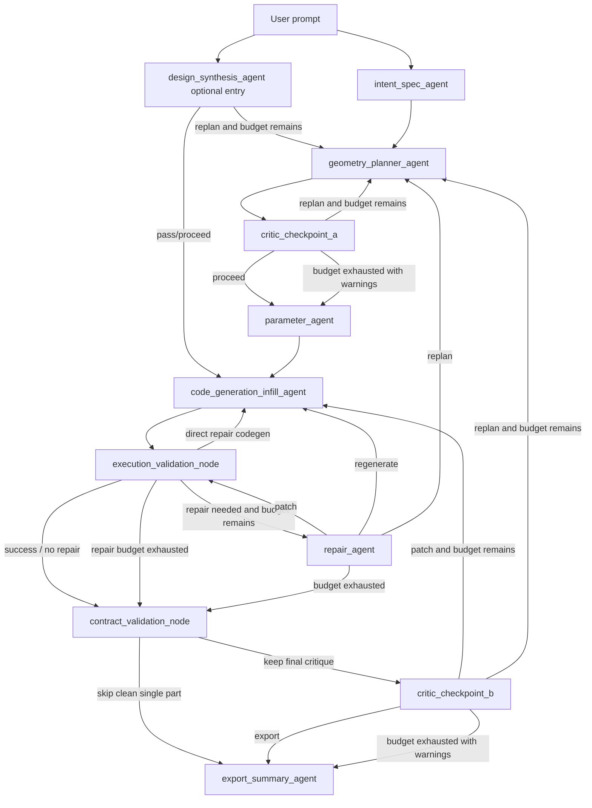

# ADR: CadPilot v3 Architecture

Status: Accepted as current architecture documentation

Date: 2026-06-23

Project: CadPilot v3

Decision owners: CadPilot v3 maintainers

Related implementation:

- `src/cadpilotv3/graph/pipeline.py`
- `src/cadpilotv3/graph/nodes.py`
- `src/cadpilotv3/graph/routing.py`
- `src/cadpilotv3/graph/pipeline_state.py`
- `src/cadpilotv3/services/`
- `src/cadpilotv3/agents/`
- `src/cadpilotv3/schemas/`
- `src/cadpilotv3/prompts/`
- `streamlit_app.py`
- `main.py`
- `scripts/stream_pipeline.py`
- `artifacts/*.mmd`
- `tests/unit/`

## Executive Summary

CadPilot v3 is a natural-language-to-CAD system that transforms a user request into validated CadQuery geometry, exported CAD files, and a user-facing summary. The architecture is a typed, multi-agent pipeline coordinated by LangGraph. It separates orchestration, agent prompt construction, deterministic services, schema contracts, sandboxed execution, validation, repair, critique, export, tracing, and UI concerns.

The key architectural decision is to treat CAD generation as a bounded state machine rather than a single prompt. Each stage owns a specific responsibility: intent extraction, geometry planning, planning critique, parameter selection, CadQuery code generation, execution validation, deterministic contract validation, repair or regeneration, final critique, export, and reporting. The pipeline uses explicit Pydantic schemas and generated script preflight checks to reduce free-form model drift. It also records local LLM traces and sandbox artifacts so quality and cost can be analyzed after each run.

This architecture optimizes for debuggability, repairability, and measurable iteration. It accepts higher implementation complexity and more LLM calls in exchange for stronger contracts, clearer failure localization, and multiple opportunities to recover from invalid geometry.

## Context

CadPilot v3 must solve a difficult problem: CAD generation requires geometric correctness, manufacturability awareness, executable code, and usable exports. A single model response can fail in many ways:

- The prompt may omit or ambiguously describe critical dimensions.
- The model may choose an invalid coordinate convention or assembly layout.
- The model may generate CadQuery code with syntax errors, API misuse, invalid selectors, degenerate sketches, impossible fillets, or broken exports.
- The code may execute but produce empty, zero-volume, non-manifold, misaligned, or semantically incomplete geometry.
- The final artifact may miss required features even when the script runs.
- Users need progress visibility because end-to-end generation can require several LLM and sandbox steps.

The repository shows that CadPilot v3 already addresses these challenges through a staged graph, typed contracts, deterministic validators, execution artifacts, optional web research, streaming events, and benchmark analysis.

## Decision

CadPilot v3 will use a contract-centered, multi-agent LangGraph architecture with deterministic validation and bounded repair loops.

The accepted architecture consists of these major decisions:

1. Use LangGraph as the pipeline orchestrator.
2. Represent run state with a typed `PipelineState`.
3. Keep graph nodes thin and route work into services.
4. Keep LLM-facing adapters in `agents/`, deterministic behavior in `services/`, and contracts in `schemas/`.
5. Use Pydantic schemas as the boundary between LLM output and pipeline state.
6. Generate complete CadQuery scripts with strict preflight validation before execution.
7. Execute generated scripts in per-run sandbox directories and inspect resulting geometry.
8. Require generated scripts to expose a `BUILD_MANIFEST` and `validate_geometry`.
9. Run deterministic contract validation after execution and before final critique.
10. Use repair, regeneration, and replanning as explicit graph routes with attempt budgets.
11. Support synchronous and asynchronous streaming modes from the same graph shape.
12. Persist local traces and sandbox artifacts for benchmark and debugging workflows.
13. Keep Streamlit as a thin demonstration UI over the streaming pipeline.

## Architecture Overview

At runtime, a user prompt enters through `main.py`, `scripts/stream_pipeline.py`, or `streamlit_app.py`. The application loads settings, configures logging and tracing, builds the LangGraph pipeline, initializes `PipelineState`, and invokes the graph.

The current graph has two supported entry shapes. The default front half is the explicit intent/plan/parameter sequence:

```text
user_prompt
  -> intent_spec_agent
  -> geometry_planner_agent
  -> critic_checkpoint_a
  -> parameter_agent
  -> code_generation_infill_agent
  -> execution_validation_node
  -> contract_validation_node
  -> critic_checkpoint_b
  -> export_summary_agent
  -> END
```

When `cad_enable_design_synthesis` is enabled, the graph starts with `design_synthesis_agent`. That node populates `spec`, `geometry_plan`, `parameters`, and `critic_a_report` together, then routes either directly to code generation on a passing self-check or back to geometry planning when the synthesized plan needs rework:

```text
user_prompt
  -> design_synthesis_agent
  -> code_generation_infill_agent   when verdict is pass or routing is proceed
  -> geometry_planner_agent         when self-check requests replan and budget remains
```

The current failure and quality-control routes are:

```text
design_synthesis_agent -> code_generation_infill_agent
design_synthesis_agent -> geometry_planner_agent
critic_checkpoint_a -> geometry_planner_agent
execution_validation_node -> repair_agent
execution_validation_node -> code_generation_infill_agent
execution_validation_node -> contract_validation_node
repair_agent -> execution_validation_node
repair_agent -> code_generation_infill_agent
repair_agent -> geometry_planner_agent
repair_agent -> contract_validation_node
contract_validation_node -> critic_checkpoint_b
contract_validation_node -> export_summary_agent
critic_checkpoint_b -> code_generation_infill_agent
critic_checkpoint_b -> geometry_planner_agent
critic_checkpoint_b -> export_summary_agent
```

Optional settings can alter the front half or final critique:

- `cad_enable_design_synthesis`: starts with `design_synthesis_agent`, which can synthesize intent, plan, parameters, and a self-check in one stage.
- `cad_enable_conditional_critic_b`: allows clean single-part runs to skip Critic B after contract validation.
- `cad_enable_direct_repair_codegen`: allows a first simple patch-class failure to route directly back to code generation.
- `cad_enable_llm_export_summary`: controls whether the final report uses an LLM or deterministic summary generation.

## Current Graph Routing Semantics

The routing logic is a core architectural boundary. It converts validation and critique outputs into deterministic graph edges, and it owns the loop-stop behavior that prevents runaway agent calls.

### Design Synthesis Routing

`route_design_synthesis` reads `critic_a_report` from the design synthesis output. If `verdict == "pass"` or `routing == "proceed"`, the graph skips the separate parameter stage and routes to `code_generation_infill_agent`, because design synthesis has already produced parameters.

If the self-check fails and `critic_a_attempts` is below `cad_max_critic_a_attempts`, the graph routes to `geometry_planner_agent`. If the budget is exhausted, issue descriptions are appended to `user_facing_warnings`, and the graph proceeds to code generation instead of looping.

This means design synthesis is an optimization path, not a bypass around quality control.

### Critic A Routing

`route_critic_a` decides whether the explicit geometry plan is ready for parameterization. Passing or proceed reports route to `parameter_agent`. Failed replan reports route back to `geometry_planner_agent` while the attempt budget remains.

When the budget is exhausted, the graph carries issue descriptions forward as warnings and routes to `parameter_agent`. This keeps the pipeline useful in imperfect cases while preserving user-visible caveats.

### Execution Validation Routing

`route_validation` is the main bridge between executable geometry and repair. If `validation.repair_needed` is false, execution has produced acceptable geometry and the graph routes to `contract_validation_node`.

If repair is needed and `repair_count` has reached `cad_max_repair_attempts`, the graph routes to `contract_validation_node` rather than attempting another repair. If `direct_repair_codegen` is true, the graph routes directly to `code_generation_infill_agent`; otherwise it routes to `repair_agent`.

The direct repair codegen path is only prepared by `PipelineNodes._prepare_direct_repair_codegen` for a first failure, no existing repair history, `repair_complexity == "patch"`, and a patch-class error such as syntax, indent, name, API misuse, type, import, or export-format failure.

### Repair Routing

`route_repair` consumes the structured `RepairOutput` decision:

- `action == "patch"` routes to `execution_validation_node` after the patch is applied to the current script.
- `action == "regenerate"` routes to `code_generation_infill_agent`.
- `action == "replan"` routes to `geometry_planner_agent`.
- exhausted repair budget routes to `contract_validation_node`.
- unrecognized or stop-like actions also fall through to `contract_validation_node`.

The repair node records compact repair history in state before incrementing `repair_count`. Later repair prompts and codegen prompts can use that history to avoid repeating the same failed patch strategy.

### Contract Validation Routing

`route_contract_validation` normally routes to `critic_checkpoint_b`. It only skips Critic B when all of the following are true:

- `cad_enable_conditional_critic_b` is true.
- `repair_count == 0`.
- `user_facing_warnings` is empty.
- execution validation status is `success`.
- execution validation reports `geometry_valid == true`.
- execution validation reports `repair_needed == false`.
- contract validation status is `pass`.
- contract validation reports `passed == true`.
- contract validation has zero failures and zero warnings.
- the output is not an assembly and has at most one part.

This makes Critic B skipping conservative. Assemblies, repaired runs, existing warnings, contract warnings, contract failures, dirty validation states, and multi-part outputs still receive final critique.

### Critic B Routing

`route_critic_b` is the final semantic routing gate:

- `routing == "export"` routes to `export_summary_agent`.
- `routing == "patch"` routes to `code_generation_infill_agent` while the Critic B budget remains.
- `routing == "replan"` routes to `geometry_planner_agent` while the Critic B budget remains.
- exhausted Critic B budget appends issue descriptions to `user_facing_warnings` and routes to export summary.

Critic B therefore has authority to request local code correction or upstream replanning, but not to loop without limit.

## Component Model

### Entry Points

`main.py` is the default command-line runner. It supports synchronous execution and an async streaming mode. It configures logging, LangSmith, local LLM tracing, and prints final exports, warnings, report preview, and validation details.

`scripts/stream_pipeline.py` exposes a dedicated streaming CLI with `jsonl`, `readable`, and `code` output modes. This makes the pipeline usable by automation and debugging tools.

`streamlit_app.py` provides a side-by-side chat and STEP viewer demo. It delegates pipeline execution to `cadpilotv3.ui.pipeline_adapter` and model viewing to `cadpilotv3.ui.step_viewer`.

### Orchestration Layer

`src/cadpilotv3/graph/pipeline.py` builds both sync and async graphs. It adds the same logical nodes in both modes and wires conditional edges through functions in `routing.py`.

`PipelineState` is a `TypedDict` containing the evolving run state:

- user prompt
- intent spec
- geometry plan
- parameter schema
- generated script
- execution validation report
- contract validation report
- critic reports
- repair decision and repair history
- attempt counters
- final geometry pointer
- export files
- user-facing warnings
- assembly report markdown

`PipelineNodes` in `graph/nodes.py` owns node implementations. It instantiates services once and keeps graph node methods focused on state transition logic.

### Routing Layer

`graph/routing.py` centralizes conditional decisions:

- Critic A can proceed to parameter selection or send the plan back to the planner.
- Execution validation can proceed to contract validation, use a direct repair codegen path, or invoke the repair agent.
- Repair can patch, regenerate, replan, or stop at contract validation after budget exhaustion.
- Contract validation can either proceed to Critic B or skip directly to export summary when the run is clean and the feature flag permits it.
- Critic B can export, patch through codegen, or replan through the planner.

The routing layer uses settings-based budgets such as `cad_max_repair_attempts`, `cad_max_critic_a_attempts`, and `cad_max_critic_b_attempts`. When an attempt budget is exhausted, the pipeline preserves warnings and moves forward instead of looping indefinitely.

### Agent Layer

The `agents/` package wraps LLM interactions. Agents build prompts from:

- system prompt files
- few-shot example files
- selected prompt context
- structured state objects serialized to JSON
- repair or critic feedback
- selected CadQuery cheatsheet blocks
- optional web research context

Most structured agents call shared helpers such as `invoke_pydantic` or `ainvoke_pydantic`. These helpers parse JSON, validate against Pydantic schemas, persist traces, and retry malformed structured output once with a schema-aware corrective prompt.

The code generation agent is text-oriented because it must produce Python source. It still uses trace metadata and a strict service-layer preflight gate.

### Service Layer

The `services/` package contains application behavior that should not live in prompt adapters:

- `IntentSpecService` executes intent extraction and logs core spec metadata.
- `GeometryPlannerService` produces geometry plans, including feedback-aware replanning.
- `CriticCheckpointAService` reviews plans before parameterization.
- `ParameterService` selects literal numeric parameter schemas.
- `CodeGenerationInfillService` extracts code, validates script structure, retries bad generations, streams code chunks, and applies function-level patches.
- `CadQueryExecutionSandboxService` executes generated scripts in `.sandbox_runs/`.
- `ExecutionValidationAgent` deterministically classifies sandbox results into validation reports.
- `ContractValidationService` checks feature, manifest, part frame, and assembly contracts.
- `RepairService` requests patch, regenerate, or replan decisions.
- `CriticCheckpointBService` performs final semantic critique.
- `ExportSummaryService` exports geometry and produces final summaries.
- `GeometryExportService` exports STEP, STL, DXF, and IGES when direct sandbox exports are not already available.
- `WebResearchService` optionally enriches product-interface prompts with real-world dimensions.

This split keeps prompt construction replaceable while preserving deterministic gates around generated code and geometry.

### Schema Layer

The `schemas/` package defines the pipeline contracts. Important schemas include:

- `IntentSpec`: component intent, constraints, dimensions, units, parts, research facts, and clarifications.
- `GeometryPlan`: artifact type, coordinate conventions, planned parts, feature contracts, assembly contracts, frames, joints, interfaces, risks, and transform chains.
- `ParameterSchema`: named manufacturing and geometric parameters.
- `ValidationReport`: execution status, error classification, geometry validity, repair requirement, geometry report, generated validation, and build manifest.
- `ContractValidationReport`: deterministic pass, warn, fail, or skip checks.
- `RepairOutput`: patch, regenerate, replan, or stop decision.
- `CriticReport` and `CriticBReport`: critique results and routing recommendations.
- `ExportSummary` and `ExportedFile`: final output records.

The system intentionally tolerates some harmless extra fields from LLM output with `extra = "ignore"`, but uses validators to normalize common shape slips, such as string values where lists are expected.

## Contract Model

CadPilot v3 uses contracts at several layers. This is the main mechanism that keeps a generative CAD pipeline testable and evaluable.

### Intent Contract

`IntentSpec` captures the user request as structured design intent:

- component and component type
- degrees of freedom, joint types, and parts
- requested output format and units
- scale, style, manufacturing process, and constraints
- explicit dimensions and explicit constraints
- researched dimensions and sources
- clarifications still needed

This contract deliberately separates user intent from geometry strategy. It gives downstream stages a stable interpretation of the prompt while preserving uncertainty as clarifications or warnings.

### Geometry Plan Contract

`GeometryPlan` is the most important semantic contract. It defines what the generated CAD model must contain and how it should be evaluated. It includes:

- `artifact_type`: `single_part` or `assembly`.
- `coordinate_convention`: X/Y/Z direction, world origin, and zero configuration.
- `parts`: planned parts, modeling strategy, local origin, body type, and key features.
- `feature_contracts`: required features with id, host part, type, operation, axis, center, dimensions, count group, and required flag.
- `required_features`: explicit ids that must appear in the generated manifest.
- `part_frames`: named part origins, world centers, approximate bounding boxes, and functional faces.
- `assembly_contracts`: deterministic spatial contracts with id, type, parts, axes, feature refs, target, tolerance, and description.
- `assembly_placement_constraints`: prose placement constraints that guide modeling and critique.
- `alignment_groups`, `assembly_transform_chain`, `joint_definitions`, `interfaces`, `forbidden_layouts`, and `failure_risks`.

The plan is not simply an intermediate prompt artifact. It is the source of truth for the generated script manifest and deterministic contract validation.

### Parameter Contract

`ParameterSchema` requires at least one parameter and enforces `SCREAMING_SNAKE_CASE` names. Each `ParameterDefinition` has:

- literal value
- unit
- description
- optional min and max
- dependencies
- constraint note
- derived flag and `derived_from` relationship

The schema forbids extra fields. This strictness matters because parameter names are consumed by code generation and repair prompts. A sloppy parameter contract tends to become a runtime name error or an invalid dimension later.

### Generated Script Contract

The generated CadQuery script is a formal artifact, not just model output. `CodeGenerationInfillService` rejects generated text unless it satisfies the script contract:

- the first line is exactly `import cadquery as cq`
- exactly one public entrypoint exists: `build_part()` or `build_assembly()`
- `validate_geometry(...)` exists
- `export_all(...)` exists
- a top-level literal `BUILD_MANIFEST` exists
- `BUILD_MANIFEST` has list keys `features`, `part_frames`, and `assembly_constraints`
- `validate_geometry(...)` returns or includes the manifest under `build_manifest`
- the script has exactly one `if __name__ == "__main__"` block
- the main block builds the object, calls `validate_geometry`, and calls `export_all`
- result names such as `model`, `assembly`, `result`, and `final_geometry` are assigned only inside the main block
- `validate_geometry` does not assert, raise, rebuild, export, save, or mutate geometry
- forbidden implicit hole helpers are not used
- brittle global volume or bounding-box heuristic keys are not used

The contract intentionally pushes the model toward explicit cutters, positive validation checks, and manifest-based semantic evidence.

### Build Manifest Contract

`BUILD_MANIFEST` is the handoff from generated code back to deterministic validation. It must expose:

- `features`: generated feature records keyed by plan feature ids.
- `part_frames`: generated part-frame records keyed by part name.
- `assembly_constraints`: generated assembly-constraint records keyed by plan contract ids.

Feature records are expected to preserve identifiers and metadata such as host part, feature type, operation, axis, center, dimensions, count group, and required flag. Part-frame records are expected to include numeric `center_mm` and `bbox_mm` when available. Assembly constraint records preserve id, type, parts, axes, feature refs, target, and tolerance.

The manifest does not prove geometry by itself. It creates an auditable claim that can be compared against executed geometry metadata.

### Execution Validation Contract

`ValidationReport` converts sandbox artifacts into an evaluation-ready result. It records:

- status
- normalized error class
- error location, message, and summary
- execution time
- geometry validity
- repair requirement and repair complexity
- geometry report
- build manifest
- generated validation payload

The geometry report carries part count, bounding box, volume, manifold signal, face count, zero-volume flag, assembly validity, and child metadata. Assembly child metadata is crucial because contract validation compares named parts against their executed centers and bounding boxes.

### Contract Validation Report

`ContractValidationReport` is the deterministic semantic evaluation output. It contains:

- `status`: `pass`, `fail`, `warn`, or `skip`
- `passed`: boolean interpretation
- human-readable summary
- individual `ContractCheck` records
- failure, warning, and skipped counts
- compact evidence strings for downstream critique and reporting

Each `ContractCheck` has:

- id
- category
- status
- severity
- message
- evidence dictionary

This makes contract failures machine-readable enough for routing and human-readable enough for debugging.

### Contract Check Categories

The current deterministic contract evaluator checks:

- `contract_presence`: skips validation when no feature or assembly contracts exist.
- `manifest_presence`: fails when required contracts exist but no manifest is exposed.
- `manifest_shape`: verifies manifest keys are lists.
- `feature_coverage`: verifies required plan feature ids appear in manifest features.
- `feature_consistency`: checks host part, type, axis, and count group metadata against the plan.
- `assembly_contract_coverage`: verifies plan assembly contract ids appear in manifest constraints.
- `part_frame_coverage`: verifies planned part frames appear in manifest part frames.
- `child_metadata_coverage`: verifies manifest part frames correspond to executed assembly children.
- `part_frame_accuracy`: compares manifest centers and bounding boxes with executed child metadata.
- `spatial_contract`: evaluates implemented deterministic spatial relationships.

Current deterministic spatial contracts include:

- `centered`: parts share centers on declared axes within tolerance.
- `coaxial`: referenced feature centers align perpendicular to the declared axis.
- `above`: the second part is above the first on the declared axis.
- `between`: later parts lie between the first two parts on the declared axis.
- `no_intersection`: declared parts do not intersect using axis-aligned bounding boxes.

Unsupported spatial contract types are marked `skip` rather than falsely passed.

### Contract Severity Semantics

Contract checks use severity to help downstream interpretation:

- `critical`: missing manifest or missing required feature evidence.
- `major`: semantic mismatch, missing assembly coverage, part-frame mismatch, or spatial contract violation.
- `minor`: tolerance drift that should be surfaced but may not make the artifact unusable.
- `info`: successful checks and intentional skips.

Routing currently uses aggregate status and counts rather than per-severity routing, but severity is available for reporting, future dashboards, and benchmark slicing.

## Runtime Flow

### 1. Intent Specification

The intent stage converts a natural-language CAD request into structured design intent. It can optionally invoke `WebResearchService` for prompts involving real-world product interfaces such as phone holders, PCBs, connectors, bearings, NEMA motors, USB-C, or mounting patterns.

Research is intentionally narrow:

- It only triggers when product/interface terms are present.
- It respects explicit user phrases such as "no web research."
- It only runs for the OpenAI provider.
- It continues without blocking the pipeline if research fails.

The output is an `IntentSpec` with researched dimensions and sources folded into the structured contract.

### 2. Geometry Planning

The geometry planner transforms the intent spec into a `GeometryPlan`. This plan is not just prose. It includes parts, modeling strategies, coordinate conventions, feature contracts, part frames, assembly placement constraints, alignment groups, interfaces, joint definitions, and failure risks.

This stage is where the system decides whether the artifact is a single part or assembly, how coordinate frames are defined, and which features must be implemented and later verified.

### 3. Critic Checkpoint A

Critic A reviews the plan before parameterization and code generation. It can pass the plan or route back to the planner. Attempt budgets prevent infinite planning loops.

This checkpoint exists because planning mistakes are cheaper to correct before code is generated.

### 4. Parameter Selection

The parameter agent converts the approved plan and user prompt into a literal parameter schema. Tests enforce that parameter names are well-formed and that flat model output is normalized where possible.

Parameterization creates a stable bridge between design intent and code generation, making later repair prompts more specific.

### 5. CadQuery Code Generation

`CodeGenerationInfillService` requests a complete script from `CodeGenerationInfillAgent`. The generated script must satisfy strict preflight rules before it can execute.

The script must:

- Start with exactly `import cadquery as cq`.
- Define exactly one public entrypoint: `build_part()` or `build_assembly()`.
- Define `validate_geometry(...)`.
- Define `export_all(...)`.
- Define a top-level `BUILD_MANIFEST` dictionary.
- Include `features`, `part_frames`, and `assembly_constraints` lists in the manifest.
- Include a single `if __name__ == "__main__"` export block.
- Build the model or assembly, call validation, and call export.
- Avoid assigning result object names at top level outside the main block.
- Avoid CadQuery implicit hole helpers such as `.hole()`, `.cboreHole()`, and `.cskHole()`.
- Avoid brittle validation heuristic keys such as `volume_reasonable` or `expected_bounding_box`.
- Keep `validate_geometry` side-effect-free.

Invalid codegen output is rejected before sandbox execution. The service persists rejected attempts under `artifacts/codegen_failed_attempts/` and retries with a compact corrective prompt.

### 6. Sandbox Execution

`CadQueryExecutionSandboxService` creates a unique `.sandbox_runs/run_<id>/` directory, prechecks syntax, writes `generated_script.py`, changes into the run directory, executes the script, captures stdout and stderr, extracts generated validation payloads, inspects resulting geometry, and writes `execution_artifacts.json`.

Geometry inspection records:

- part count
- bounding box
- volume
- manifold or validity signal
- face count
- zero-volume flag
- assembly validity
- per-child metadata for assemblies

The service can identify common result names such as `assembly`, `result`, `model`, or `final_geometry`, and can materialize geometry through `build_assembly()` or `build_part()` when needed.

### 7. Execution Validation

`ExecutionValidationAgent` turns sandbox artifacts into a `ValidationReport`. Despite the name, it is deterministic in the current implementation.

It classifies failures into categories such as:

- `syntax_error`
- `indent_error`
- `name_error`
- `import_error`
- `api_misuse`
- `type_error`
- `parameter_overflow`
- `fillet_radius_overflow`
- `export_format_error`
- `empty_selection`
- `topology_error`
- `degenerate_sketch`
- `silent_empty_result`
- `zero_volume_solid`
- `non_manifold_geometry`
- `assembly_misalignment`

Patchable classes can route to repair or direct regeneration. Structural or semantic geometry failures usually route to replanning.

### 8. Contract Validation

`ContractValidationService` compares the `GeometryPlan`, `ValidationReport`, and generated `BUILD_MANIFEST`. It checks:

- Manifest shape.
- Required feature coverage.
- Feature metadata consistency.
- Assembly contract coverage.
- Part frame coverage.
- Executed child metadata coverage.
- Part frame center and bounding box accuracy.
- Spatial contracts such as centered, coaxial, above, between, and no-intersection.

This stage is important because a model can produce valid geometry that is still missing required design features. Contract validation creates a deterministic semantic guardrail before final critique or export.

### 9. Repair, Regeneration, and Replanning

When execution validation requires repair, the graph can take several routes:

- Patch a specific function and rerun execution.
- Regenerate the complete script with repair context.
- Replan geometry if the failure suggests the design plan is invalid.
- Stop and continue after max repair attempts.

Repair history is appended into state with attempt index, validation error class, summary, action, root cause, affected function, patch errors, and replan instructions. This gives later attempts context without relying on hidden memory.

### 10. Critic Checkpoint B

Critic B reviews final geometry, validation, contract validation, parameters, and prior critique. It can route to export, patch, or replan. Conditional Critic B can be skipped for clean single-part outputs when enabled, but assemblies, repaired runs, warnings, and contract issues keep the final critique in the path.

### 11. Export and Summary

`ExportSummaryService` first collects exports created by the sandbox script. If none are available, it falls back to `GeometryExportService`.

Supported export formats include:

- STEP
- STL
- DXF for flat or 2D geometry
- IGES

The summary can be LLM-generated or deterministic. The deterministic summary includes request overview, validation status, geometry metadata, child part metadata, key parameters, export files, and warnings.

## Data and Artifact Flow

Persistent local artifacts are part of the architecture:

- `.sandbox_runs/run_<id>/generated_script.py`
- `.sandbox_runs/run_<id>/execution_artifacts.json`
- `artifacts/llm_runs/<run_id>/<call>_<agent>/prompt.txt`
- `artifacts/llm_runs/<run_id>/<call>_<agent>/raw_response.txt`
- `artifacts/llm_runs/<run_id>/<call>_<agent>/metadata.json`
- `artifacts/codegen_failed_attempts/<attempt_id>/`
- `output/`
- `artifacts/*.mmd`
- `artifacts/pipeline_graph.png`

These artifacts support debugging, benchmark analysis, prompt improvement, and failure triage.

## Evaluation Methodology

CadPilot v3 should be evaluated as a multi-stage generation system, not just as a model prompt. Evaluation must measure whether the system produced an executable, contract-compliant CAD artifact within acceptable cost and latency.

The system includes local trace analysis in `scripts/analyze_llm_traces.py` and documented benchmark reports in `artifacts/BENCHMARKING.md` and `artifacts/BENCHMARKING_IMPROVEMENT.md`. Those reports are useful historical signals, but the ADR treats controlled evaluation as a separate architecture requirement.

### Evaluation Questions

The evaluation methodology should answer:

- Did the pipeline complete without an unhandled exception?
- Did the generated code pass static preflight?
- Did the generated code execute?
- Did execution produce inspectable geometry?
- Was geometry valid: positive volume, non-zero parts, manifold or valid shape, and assembly-valid where applicable?
- Did the generated script expose a complete manifest?
- Did required features appear in the manifest?
- Did manifest metadata match the geometry plan?
- Did part frames match executed child metadata?
- Did assembly and spatial contracts pass?
- Did Critic B accept the artifact or require patch/replan?
- Were warnings produced, and were they acceptable?
- Were expected export files created?
- How many LLM calls, retries, repairs, replans, and critique loops were required?
- What was wall-clock duration and sandbox execution time?
- What prompt, response, token, and cost budget was consumed?

### Fixed Prompt Corpus

Evaluation should use a fixed prompt corpus that spans common and difficult CAD categories:

- simple single-part block with through holes
- FDM printable bracket with chamfers and slots
- bearing pillow block with press-fit feature
- electronics enclosure lid or snap-fit cover
- two-part enclosure assembly
- NEMA motor mount or adapter plate with real interface dimensions
- multi-part assembly with centered, above, between, no-intersection, or coaxial contracts
- deliberately ambiguous prompt requiring conservative assumptions
- prompt with product-interface research disabled
- prompt with product-interface research enabled

Each prompt should have expected evaluation metadata: artifact type, required export formats, important features, rough expected part count, and any hard dimensions that should become contracts.

### Configuration Matrix

Each benchmark run should record the graph mode and settings. At minimum, compare:

- baseline explicit front half: intent, planner, Critic A, parameter
- `cad_enable_design_synthesis=true`
- `cad_enable_conditional_critic_b=true`
- `cad_enable_direct_repair_codegen=true`
- `cad_enable_llm_export_summary=false`
- provider and model profile combinations for structured, planner, coder, critic, and summary profiles

The same prompt corpus must be run under each named configuration. Historical mixed traces should not be used as proof of improvement across modes.

### Stage-Level Metrics

For each run, collect:

- entry mode: explicit or design synthesis
- final graph status: completed, failed, or aborted
- node visit count by node name
- design synthesis self-check result and route
- Critic A verdict, route, and attempts
- parameter schema validation result
- codegen attempt count
- codegen preflight failures by reason
- compact retry usage
- sandbox syntax status
- sandbox execution status
- sandbox execution time
- execution validation status and error class
- repair decision actions by attempt
- repair history count
- contract validation status, failure count, warning count, skipped count
- Critic B route and attempts
- export count by format
- user-facing warning count

These metrics make graph routing behavior measurable rather than anecdotal.

### Contract Metrics

Contract evaluation should be first-class. For each run, aggregate:

- planned required feature count
- manifest feature count
- required feature coverage rate
- feature consistency pass rate
- assembly contract count
- assembly contract coverage rate
- part frame coverage rate
- child metadata coverage rate
- spatial contract pass, fail, warn, and skip counts
- contract failure severity distribution
- compact evidence strings

Useful derived metrics:

- `contract_pass_rate = pass_runs / contract_evaluated_runs`
- `required_feature_coverage_rate = matched_required_features / required_features`
- `assembly_contract_coverage_rate = manifest_constraints_matched / planned_assembly_contracts`
- `spatial_contract_success_rate = passed_spatial_checks / non_skipped_spatial_checks`
- `semantic_clean_run_rate = validation_success && contract_pass && no_warnings`

These metrics should be reported separately for single-part and assembly prompts because assemblies exercise more contract types and should not be diluted into a single aggregate.

### Quality Gates

A generated artifact should be considered successful only when all required gates pass:

1. Pipeline completes.
2. Codegen preflight passes.
3. Sandbox execution succeeds.
4. Geometry report is present.
5. Validation status is `success`.
6. Geometry validity is true.
7. Contract validation status is `pass` or an explicitly accepted `warn`.
8. Required exports are present.
9. User-facing warnings are empty or accepted for the benchmark category.

For strict benchmark reporting, `warn` should be reported separately from `pass`; warnings should not be hidden inside success.

### Human Review Rubric

Automated checks should be paired with human or golden-reference review for a representative subset. Reviewers should score:

- prompt fidelity
- dimensional plausibility
- manufacturability
- feature completeness
- assembly layout correctness
- part naming and export usefulness
- repair quality after failure
- final report clarity

Suggested scale: 1 to 5 per dimension, with a short reason and link to the generated script, exports, trace directory, and sandbox artifacts.

### Failure Taxonomy

Failures should be normalized by source:

- intent failure: wrong component interpretation or missed hard constraints
- planning failure: missing feature contract, wrong artifact type, bad coordinate convention
- parameter failure: invalid value, missing dependency, malformed schema
- codegen preflight failure: missing entrypoint, bad manifest, forbidden API, side-effect validation
- runtime failure: syntax, name, import, API misuse, selector, topology, parameter overflow, export
- geometry failure: empty result, zero volume, non-manifold, assembly invalid
- contract failure: missing manifest, feature missing, part frame mismatch, spatial contract violation
- critique failure: Critic B detects semantic mismatch after deterministic checks
- export failure: required CAD file not produced
- reporting failure: summary missing or misleading

This taxonomy should be used in benchmark dashboards and retrospective analysis.

### Existing Baseline Signals

The current local trace corpus is mixed, but it identifies useful pressure points:

- Geometry planning had the largest traced failure count in the local corpus.
- Code generation had the largest prompt-volume hotspot.
- Repair had high prompt volume but no parse/validation failures in the sampled trace report.
- Sandbox execution was fast locally, but historical execution success was below 50 percent across mixed artifacts.
- The trace corpus mixed legacy and newer pipeline modes, so design synthesis requires separate controlled measurement.

The ADR therefore adopts observability and controlled evaluation as architectural requirements, not afterthoughts.

## Technology Choices

### Python 3.11+

Python is the core implementation language because CadQuery, LangChain, LangGraph, Pydantic, Streamlit, and test tooling are all Python-native in this project.

### CadQuery

CadQuery is the geometry kernel and script target. The generated output is not direct CAD data; it is executable CadQuery code that can be inspected, repaired, and exported.

### LangGraph

LangGraph is used for stateful orchestration because the pipeline needs conditional loops, typed state, async execution, and streaming updates.

### LangChain Provider Adapters

The LLM layer uses LangChain chat models with OpenAI, OpenRouter, and Anthropic provider support. This allows agent/profile mapping without changing graph logic.

### Pydantic

Pydantic schemas are used as executable contracts for LLM output, validation reports, plans, repair decisions, and export summaries.

### Streamlit

Streamlit is used as a demo UI, not as the core application architecture. The UI delegates to the same streaming pipeline used by scripts.

### LangSmith

LangSmith is optional external observability. Local trace output remains available independently.

## Alternatives Considered

### Alternative 1: Single-Shot Prompt to CadQuery

A simpler architecture could ask one model to return a full CadQuery script and then export it.

Rejected because:

- Failures would be harder to localize.
- There would be no typed intent, plan, or parameter contract.
- Repair would have little structured context.
- Missing features could pass unnoticed if geometry merely executed.
- Observability would collapse into one large prompt/response pair.

### Alternative 2: Deterministic CAD Builder from Parsed Intent

Another option would parse user intent and map it into a library of deterministic part templates.

Rejected as the primary architecture because:

- It would support only known part families.
- The project goal is broad natural-language CAD generation.
- Template coverage would become the main product bottleneck.
- Assemblies and unusual modeling strategies would require constant template expansion.

This remains useful as a future optimization for common parts.

### Alternative 3: Agent Conversation Without a Formal Graph

The system could run a free-form agent loop that decides what to do next.

Rejected because:

- It would obscure routing logic.
- Attempt budgets would be harder to enforce.
- Streaming progress would be less predictable.
- Tests would be harder to target.
- Failures would be less reproducible.

### Alternative 4: Execute Generated Code Without Preflight

Generated code could be sent straight to the sandbox.

Rejected because:

- Many known failures can be caught cheaply with AST checks.
- Preflight failures can trigger compact corrective retries before runtime.
- Required manifest and validation hooks must exist before semantic checks can work.

### Alternative 5: LLM-Based Validation Only

An LLM could inspect the script, output files, or rendered images and decide whether the artifact is acceptable.

Rejected as the only validation layer because:

- Deterministic execution and geometry checks are more reliable for syntax, runtime, manifold, volume, and manifest constraints.
- LLM critique is valuable but should sit after objective checks, not replace them.

## Consequences

### Positive Consequences

- Failures are localized to pipeline stages.
- Structured schemas make LLM output safer to consume.
- The graph can recover through repair, regeneration, or replanning.
- Generated scripts are inspectable and reusable.
- Contract validation checks semantic feature coverage, not just execution success.
- Streaming events expose progress for CLIs and UI.
- Local traces make quality and cost work measurable.
- Settings allow controlled experiments with design synthesis, conditional final critique, direct repair, and deterministic summaries.

### Negative Consequences

- The architecture has more moving parts than a single-agent implementation.
- End-to-end runs can require many LLM calls.
- Prompt and schema changes must stay coordinated.
- The generated script contract is strict, so prompt examples and codegen validation must evolve together.
- Sandboxed execution currently uses in-process `exec` with directory isolation, not a fully isolated OS sandbox.
- The UI is a demo surface and does not yet fully resolve product-level ergonomics or security concerns.

### Neutral Tradeoffs

- The system prefers explicit contracts over model flexibility.
- It keeps multiple providers available but still has OpenAI-specific web research.
- It can skip Critic B only under conservative conditions.
- It preserves artifacts locally, which is useful for debugging but requires cleanup policies for long-lived environments.

## Current Risks

### In-Process Script Execution

`CadQueryExecutionSandboxService` executes generated Python with `exec` after changing into a per-run directory. This gives filesystem organization and artifact capture, but it is not equivalent to process, user, container, or syscall isolation.

Risk: generated code can still access process-level capabilities available to the Python runtime.

Mitigation options:

- Move execution into a subprocess with timeout enforcement.
- Run code in a container or restricted worker.
- Restrict imports and builtins.
- Store sandbox outputs under a locked workspace root.
- Add explicit resource controls for CPU, memory, file size, and runtime.

### Initial State Drift

`main.py` and `scripts/stream_pipeline.py` define similar initial state builders. The UI adapter includes newer fields such as `direct_repair_codegen` and `repair_history`; the other entry points should stay synchronized.

Risk: a graph node may expect a state key that some entry point omitted.

Mitigation options:

- Centralize `build_initial_state` in one module.
- Add a test that all entry points use the central builder.
- Consider a small state factory function in `graph/pipeline_state.py`.

### UI Encoding Issues

`streamlit_app.py` and `ui/pipeline_adapter.py` currently contain mojibake in a few user-facing strings.

Risk: user-facing polish and trust are reduced.

Mitigation options:

- Normalize files to UTF-8.
- Replace affected punctuation with ASCII.
- Add a small UI text smoke test if desired.

### Benchmark Corpus Is Not Controlled

Existing benchmark reports correctly warn that the trace corpus mixes prompts, settings, graph versions, and pipeline modes.

Risk: architectural changes may be judged from non-comparable data.

Mitigation options:

- Add a fixed prompt corpus.
- Run named configurations against the same prompts.
- Aggregate token/cost metadata, sandbox results, contract validation, and wall time.

### Contract Coverage Depends on Generated Manifest Quality

Contract validation is only as complete as the plan contracts and generated `BUILD_MANIFEST`.

Risk: a generated script may pass deterministic checks if the plan or manifest under-specifies required features.

Mitigation options:

- Strengthen planner prompts and tests around feature contracts.
- Add manifest-to-script static checks for feature implementation patterns where practical.
- Add rendered-image or geometry-derived feature verification for common features.

## Security and Safety Considerations

The current architecture should be treated as a development or trusted local execution design until execution isolation is hardened.

Security-relevant points:

- LLM-generated Python is executed locally.
- The sandbox writes run artifacts under `.sandbox_runs/`.
- Exports are copied to `output/`.
- Optional web research contacts OpenAI web search when enabled and supported.
- LangSmith tracing can send run metadata externally when configured.
- Local LLM trace files store full prompts and responses, which may include user request details and generated code.

Recommended production hardening:

- Use a subprocess or container sandbox.
- Enforce wall-clock timeout at the process boundary.
- Enforce file output allowlists.
- Disable network access for generated scripts.
- Redact or scope trace retention.
- Make external tracing opt-in per deployment.

## Test Strategy

The unit test suite covers many architecture-critical contracts:

- Sync and async pipeline construction.
- Design synthesis routing.
- Streaming pipeline events and code chunk events.
- Route decisions for validation, repair, Critic A, Critic B, and contract validation.
- Codegen preflight rules and rejected output.
- Repair history and feedback routing.
- Contract validation pass/fail cases.
- Sandbox assembly child metadata.
- Execution error classification.
- Prompt context selection.
- Pydantic retry behavior and trace persistence.
- LLM profile settings.
- LangSmith configuration.
- Export summary behavior.
- Intent web research triggers and normalization.

The test suite is strongest around routing, contracts, and codegen safeguards. Future tests should focus on full end-to-end fixture prompts, sandbox isolation behavior, and controlled benchmark assertions.

## Implementation Roadmap

### Near Term

1. Centralize initial pipeline state construction.
2. Fix UI text encoding issues.
3. Add a fixed benchmark prompt corpus.
4. Extend trace analysis to join LLM calls, sandbox artifacts, contract validation, export success, and wall-clock timing.
5. Add a cleanup or retention policy for `.sandbox_runs/`, `artifacts/llm_runs/`, and failed codegen attempts.

### Medium Term

1. Move generated-code execution to a subprocess or container sandbox.
2. Add stronger resource limits and import restrictions.
3. Add controlled benchmark modes for legacy front half, design synthesis, conditional Critic B, deterministic export summary, and direct repair codegen.
4. Add more deterministic geometry-derived checks for common features.
5. Improve assembly validation beyond axis-aligned bounding boxes where needed.

### Longer Term

1. Introduce deterministic templates for common part families as an optimization path.
2. Add visual or mesh-based validation for semantic geometry quality.
3. Add persistent job storage and a richer UI workflow for reviewing, retrying, and comparing generated CAD outputs.
4. Separate trusted development execution from hardened production execution.

## Decision Outcome

The current CadPilot v3 architecture is appropriate for an iterative CAD-generation system whose primary challenges are correctness, debuggability, and recovery from LLM/code/geometry failures.

The architecture should remain multi-stage and contract-centered. The next architectural improvements should not collapse the graph; they should harden execution isolation, centralize shared state construction, improve controlled benchmarking, and expand deterministic semantic validation.

## Appendix A: Source-Derived Pipeline Diagram



## Appendix B: Architectural Invariants

- Pipeline state is the source of truth between graph nodes.
- Agent outputs crossing into state must be schema-validated or service-validated.
- Generated CadQuery scripts must pass preflight before execution.
- Generated scripts must expose `BUILD_MANIFEST`, `validate_geometry`, and `export_all`.
- Geometry plans must express required semantic features as feature or assembly contracts whenever possible.
- Execution validation must run before contract validation.
- Contract validation must run before Critic B or final summary.
- Repair and critique loops must be bounded by settings.
- Final exports must be represented as `ExportedFile` records.
- Trace and sandbox artifacts should preserve enough context to debug failures after the run.
- Evaluation must report validation success, contract success, warnings, exports, cost, latency, and route behavior separately.
